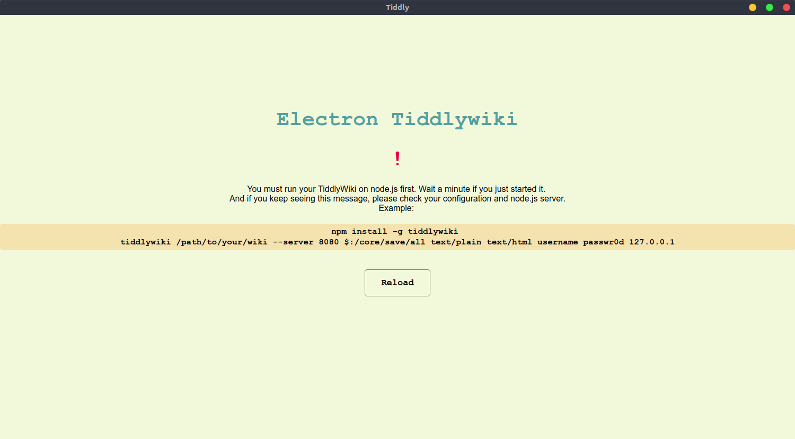
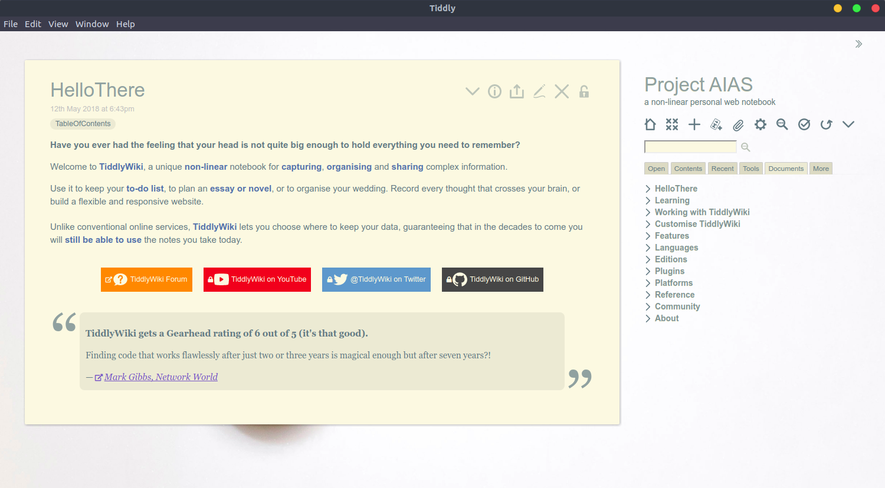

# Tiddly

An Electron desktop application for [TiddlyWiki](https://tiddlywiki.com/) on Node.js

> TiddlyWiki
>
> A non-linear personal web notebook that anyone can use and keep forever, independently of any corporation.
>
> [Github repository](https://github.com/Jermolene/TiddlyWiki5)
>
> [Website](https://tiddlywiki.com/)

## Screenshots




## Getting Started

+ [Install Node.js](https://nodejs.org/en/download/) and [npm](https://www.npmjs.com/get-npm)
+ [Install TiddlyWiki on Node.js](https://github.com/Jermolene/TiddlyWiki5#installing-tiddlywiki-on-nodejs)
  
  ```bash
  npm install tiddlywiki -g
  ```

+ Check your installation
  
  ```bash
  tiddlywiki --version
  ```
  You can see installed version of TiddlyWiki if OK.

+ Create your Wiki, remember to change the name `mynewwiki` to what you want!
  
  ```bash
  cd /path/to/store/your/wiki
  tiddlywiki mynewwiki --init server
  ```

+ Optional: You can run your Wiki now if you want to try out.
  
  ```bash
  tiddlywiki mynewwiki --server
  ```
  Visit http://127.0.0.1:8080/ in your browser
  
+ [Install Electron globally](https://electronjs.org/docs/tutorial/installation)
  
  ```bash
  npm install electron -g
  ```

+ [Install electron-packager globally](https://github.com/electron-userland/electron-packager#installation)
  
  ```bash
  npm install electron-packager -g
  ```
  
+ [Install Git](https://git-scm.com/downloads)
+ Clone this repository
  
  ```bash
  cd /path/to/store
  git clone https://github.com/oxdc/tiddly
  cd tiddly
  ```

+ Install dependencies
  
  ```bash
  npm install
  ```

+ Copy the `config-example.js` as a new file called `config.js`
  
  ```bash
  cp ./config-example.js ./config.js
  ```

+ Edit the configuration attributes
  
  ```bash
  vim ./config.js
  ```

  ```javascript
  const configuration = {
    host: '127.0.0.1', // localhost or 0.0.0.0 for web access
    port: 8080, // tiddlywiki server port
    /*
      You must change this path to your wiki's
      absolute path
    */
    wikiDir: '/absolute/path/to/your/wiki',
    /*
      NOTE: If you delete two lines below,
      your wiki site will be open to all!
      Anyone can visit and edit without login!
    */
    username: 'user', // CHANGE ME OR DELETE !!
    password: 'passw0rd', // CHANGE ME  OR DELETE !!
    /*
      If true, you won't need to enter your
      password each time you open this application.
    */
    autoLogin: true,
    /*
      Optional
      If true, Tiddly will launch the Content Server.
      You can access your files through it and never
      need to import all of them into your wiki.
    */
    enableContentServer: false
  }
  ```
+ Optional: Edit the Tiddly Content Server

  ```bash
  vim ./config.js
  ```

  ```javascript
  const configuration = {
    host: '127.0.0.1', // localhost or 0.0.0.0 for web access
    port: 8080, // tiddlywiki server port
    /*
      You must change this path to your wiki's
      absolute path
    */
    wikiDir: '/absolute/path/to/your/wiki',
    /*
      NOTE: If you delete two lines below,
      your wiki site will be open to all!
      Anyone can visit and edit without login!
    */
    username: 'user', // CHANGE ME OR DELETE !!
    password: 'passw0rd', // CHANGE ME  OR DELETE !!
    /*
      If true, you won't need to enter your
      password each time you open this application.
    */
    autoLogin: true,
    /*
      Optional
      If true, Tiddly will launch the Content Server.
      You can access your files through it and never
      need to import all of them into your wiki.
    */
    enableContentServer: true,
    // default root directory of the Tiddly Content Server
    csRoot: 'contents',
    // Tiddly Content Server host address
    csHost: '127.0.0.1',
    // port of Tiddly Content Server
    csPort: 8081,
    /*
      White list defines a series of folders that you
      can access. If anyone is trying to access a folder
      that's not contained here, it will end up with a 403
      forbidden error.

      ! Remember: accessing root directory '/' is always forbidden
    */
    csWhiteList: []
  }
  ```
  
  After the Tiddly Content Server launched, you can see a demo page at http://localhost:8081/contents .

  You can access your files through it and never need to import all of them into your wiki.

  Example:

  ```tiddler
  created: 19710101000000000
  creator: user
  modified: 19710101000000000
  modifier: user
  tags: 
  title: Content Server Test
  type: text/vnd.tiddlywiki

  [img[picturename|http://localhost:8081/contents/path/to/your/picture.png]]

  [[text|http://localhost:8081/contents/path/to/your/pdf.pdf]]
  ```

  You can edit MIME types of your Tiddly Content Server. See also [MDN Incomplete list of MIME types](https://developer.mozilla.org/en-US/docs/Web/HTTP/Basics_of_HTTP/MIME_types/Complete_list_of_MIME_types) .

  ```javascript
  const configuration = {
    // ......
    mimeType: {
      '.ico': 'image/x-icon',
      '.html': 'text/html',
      '.js': 'text/javascript',
      '.json': 'application/json',
      '.css': 'text/css',
      '.png': 'image/png',
      '.jpg': 'image/jpeg',
      '.wav': 'audio/wav',
      '.mp3': 'audio/mpeg',
      '.svg': 'image/svg+xml',
      '.pdf': 'application/pdf',
      '.doc': 'application/msword',
      '.eot': 'appliaction/vnd.ms-fontobject',
      '.ttf': 'aplication/font-sfnt'
    }
  }
  ```

+ Run this application
  
  ```bash
  electron .
  ```

+ Build (pack) this application
  
  ```bash
  electron-packager .
  ```

+ Done! Enjoy!
